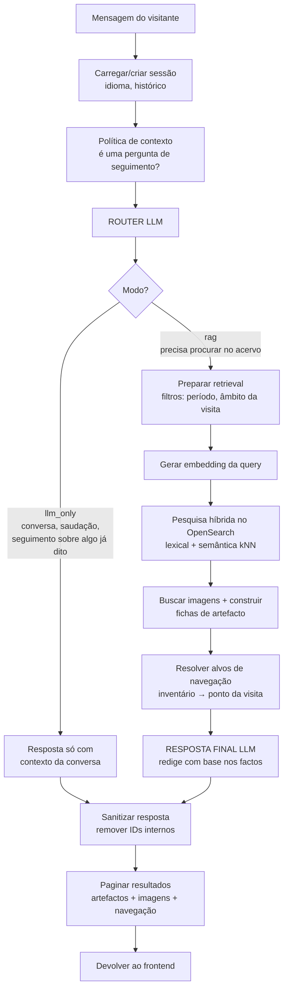
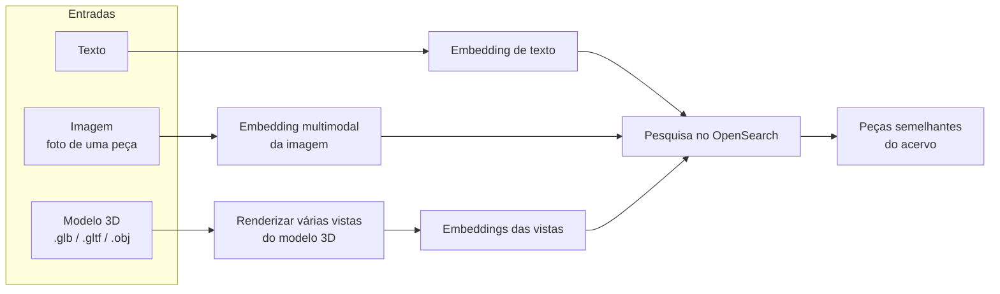
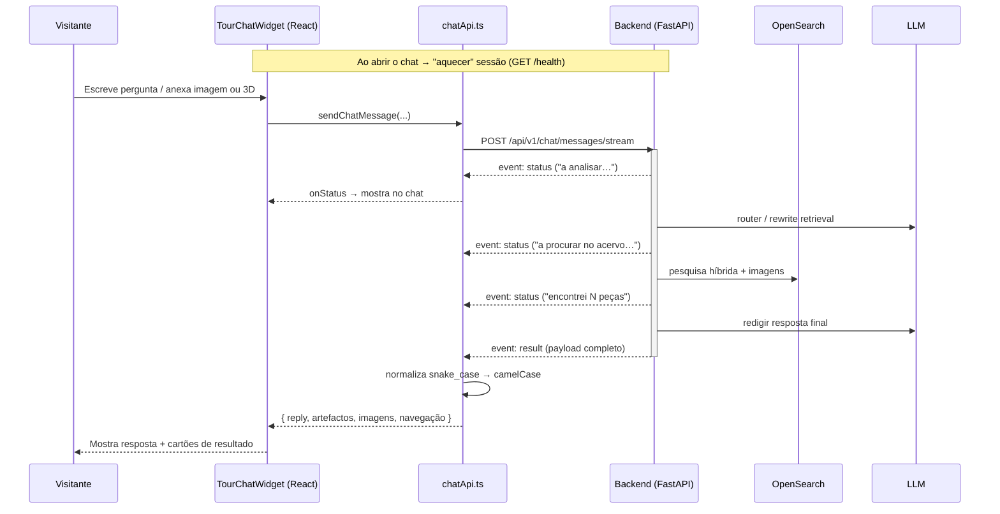
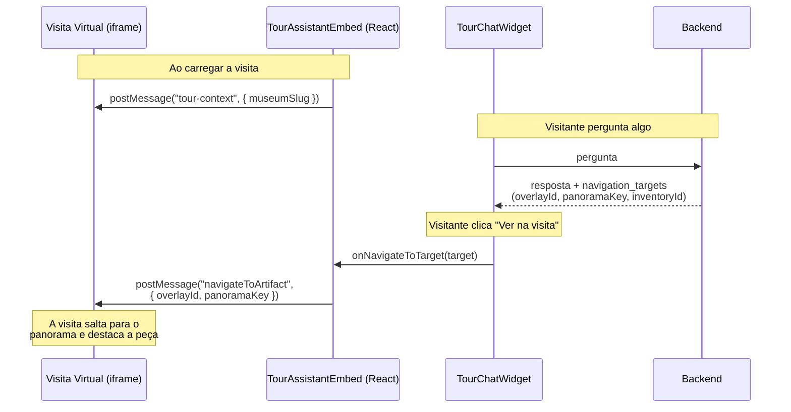

# Património 360 — Assistente Virtual de Museus

> Documento de apresentação **estrutural** (não técnico-exaustivo).
> Cobre três temas: **(1)** a pipeline RAG e os seus caminhos possíveis,
> **(2)** a comunicação Frontend ↔ Backend, **(3)** a comunicação Frontend ↔ Visita Virtual.

---

## 1. Visão geral em uma frase

O projeto é um **assistente conversacional embebido numa visita virtual 360º de um museu**.
O visitante faz perguntas (por texto, imagem ou modelo 3D), o sistema procura nas peças do
acervo do museu e responde em linguagem natural — e, quando faz sentido, **leva o visitante
até ao ponto exato da visita virtual** onde a peça está exposta.

```
┌──────────────────────────────────────────────────────────────────┐
│                      PÁGINA DO MUSEU (browser)                     │
│                                                                    │
│   ┌────────────────────────┐        ┌──────────────────────────┐  │
│   │   VISITA VIRTUAL 360º   │◄──────►│   ASSISTENTE (chat)      │  │
│   │   (iframe / tour)       │ postMsg│   TourChatWidget          │  │
│   └────────────────────────┘        └────────────┬─────────────┘  │
│                                                   │ HTTP / SSE      │
└───────────────────────────────────────────────────┼────────────────┘
                                                    ▼
                                    ┌───────────────────────────┐
                                    │       BACKEND (FastAPI)    │
                                    │   ChatService + RAG        │
                                    └───────────┬───────────────┘
                                                │
                          ┌─────────────────────┼──────────────────────┐
                          ▼                     ▼                      ▼
                   ┌────────────┐        ┌────────────┐         ┌────────────┐
                   │ OpenSearch │        │    LLM     │         │ poi_tours  │
                   │ (acervo +  │        │  (router,  │         │ (mapa      │
                   │ embeddings)│        │  resposta) │         │ inventário │
                   └────────────┘        └────────────┘         │→ visita)   │
                                                                └────────────┘
```

**Peças-chave:**
- **Frontend (React)** — widget de chat sobreposto à visita virtual.
- **Backend (FastAPI / `ChatService`)** — orquestra todo o raciocínio.
- **OpenSearch** — base de pesquisa do acervo (texto + vetores semânticos + imagens).
- **LLM** — usado para decidir o caminho (*router*), reescrever queries de retrieval
  quando necessário e redigir a resposta final.
- **`poi_tours/`** — ficheiros JSON que ligam o **número de inventário** de uma peça
  ao **ponto da visita virtual** (panorama + overlay).

---

## 2. A Pipeline RAG e os seus caminhos

RAG = *Retrieval-Augmented Generation*: o modelo **não responde de cor** — primeiro
**procura** factos no acervo do museu e só depois **redige** a resposta com base nesses factos.

A grande característica deste projeto é que **não existe um único caminho**. Consoante a
pergunta, o sistema escolhe entre vários percursos. O diagrama abaixo mostra-os todos.



### 2.1. Os caminhos, explicados

| Caminho | Quando é escolhido | Exemplo de pergunta | O que acontece |
|---|---|---|---|
| **RAG** | Perguntas que precisam de factos do acervo, incluindo perguntas abertas, listas exploratórias e perguntas quantitativas sem executor analítico | *"Fala-me sobre o traje de criança"*, *"Que peças há sobre arte sacra?"*, *"Quantos azulejos do séc. XVIII há nesta visita?"* | Procura semântica + lexical no acervo, junta as peças mais relevantes e o LLM redige a resposta **só com base nelas**. Não há executor analítico de contagens exatas nesta versão. |
| **LLM-only** | **Conversa**, saudações, ou seguimento sobre algo **já dito** | *"Olá"*, *"E quem foi o autor dessa?"* | Não vai à base de dados; responde com o contexto da própria conversa. |

### 2.2. Entradas multimodais (variações do caminho RAG)

O mesmo motor RAG aceita três tipos de "pergunta":



- **Texto** → pesquisa híbrida (palavras + significado).
- **Imagem** → o visitante envia uma foto; geramos um *embedding* multimodal e procuramos
  as peças **visualmente parecidas**.
- **Modelo 3D** → renderizamos várias vistas do objeto, geramos *embeddings* de cada uma e
  procuramos as peças mais semelhantes.

### 2.3. Onde entra cada componente externo

- **LLM** é chamado para *router* (decidir o caminho), rewrite de retrieval quando ativo
  e *resposta final*.
- **OpenSearch** guarda o acervo com três "vistas" do mesmo dado: texto pesquisável,
  vetores semânticos (texto) e vetores de imagem.
- **`poi_tours/`** é consultado **no fim**, para transformar o nº de inventário das peças
  encontradas em **pontos navegáveis da visita virtual**.

---

## 3. Comunicação Frontend ↔ Backend

A comunicação é **HTTP REST**, com uma camada de **streaming (SSE)** para mostrar o
progresso ao vivo ("a analisar pedido…", "a procurar no acervo…", "encontrei N peças…").



### 3.1. Endpoints principais (todos sob `/api/v1/chat`)

| Endpoint | Função |
|---|---|
| `GET /health` | "Aquecer" a sessão e confirmar que o backend está vivo. |
| `POST /messages` e `/messages/stream` | Pergunta por **texto** (versão simples e versão com progresso ao vivo). |
| `POST /messages/image` e `/image/stream` | Pergunta com **imagem** anexada (upload multipart). |
| `POST /messages/model` e `/model/stream` | Pergunta com **modelo 3D** anexado. |
| `POST /messages/regenerate` | Voltar a gerar a última resposta. |
| `POST /messages/results` | **Paginação** — "ver mais resultados". |
| `GET /artifacts/{id}/detail-context` | Contexto relacional de uma peça (autores, conjuntos, exposições) — carregado **só quando o visitante abre o modal**. |
| `GET /artifacts/related` | Paginação dos artefactos relacionados (dentro do modal). |
| `GET /artifacts/{id}/full` | Ficha completa de uma peça (com todas as imagens). |
| `GET /images/{ref}` | Servir os ficheiros de imagem das peças. |

### 3.2. Princípios de desenho

- **Estado de sessão no backend** — o frontend só guarda o `conversationId`. O histórico,
  os filtros ativos e os últimos resultados ficam do lado do servidor (permite seguimento:
  *"e a anterior?"*).
- **Streaming opcional** — se o frontend passa um *callback* de progresso, usa a versão
  `/stream` (SSE) e mostra mensagens de estado em tempo real; caso contrário, faz um pedido
  simples.
- **Tradução de formato** — o backend responde em `snake_case`; o `chatApi.ts` normaliza
  tudo para `camelCase` e tipos do frontend, isolando a UI de mudanças no backend.
- **Carregamento preguiçoso (lazy)** — detalhes pesados (contexto relacional, ficha
  completa, páginas extra) só são pedidos quando o visitante interage.

---

## 4. Comunicação Frontend ↔ Visita Virtual

A visita virtual é uma aplicação **externa** carregada num `<iframe>`. O assistente e a
visita comunicam por **`postMessage`** (mensagens entre janelas do browser) — não há
servidor pelo meio.



### 4.1. As duas mensagens trocadas

| Mensagem | Direção | Conteúdo | Quando |
|---|---|---|---|
| `patrimonio360:tour-context` | Assistente → Visita | `{ museumSlug }` | Quando a visita acaba de carregar (sincroniza o contexto do museu). |
| `navigateToArtifact` | Assistente → Visita | `{ overlayId, panoramaKey }` | Quando o visitante clica em **"Ver na visita"** num resultado. |

### 4.2. Como nasce um "alvo de navegação"

Este é o elo que torna o projeto distinto — ligar **uma peça do acervo** a **um ponto
físico da visita 360º**:

```
Peça encontrada no acervo
        │  (tem um número de inventário, ex. "MNAZ 1234")
        ▼
Backend consulta poi_tours/panorama-overlays-inventory-<museu>.json
        │  (índice: nº de inventário  →  overlay + panorama)
        ▼
navigation_target = { overlayId, panoramaKey, inventoryId, título, localização }
        │
        ▼
Frontend mostra botão "Ver na visita" → postMessage → a visita 360º salta para lá
```

- O serviço de navegação **normaliza** os números de inventário (maiúsculas, sem
  pontuação, lida com listas e variantes) para casar de forma robusta.
- Se uma peça **não estiver mapeada** na visita, simplesmente não aparece o botão de
  navegação — a resposta de texto continua a funcionar.

---

## 5. Resumo para a apresentação (1 slide)

- **Problema:** dar a uma visita virtual de museu um guia inteligente que percebe perguntas
  em linguagem natural e mostra fisicamente onde estão as peças.
- **Como:** assistente de chat embebido + pipeline **RAG multimodal** (texto, imagem, 3D) +
  ligação peça ↔ ponto da visita.
- **Inteligência adaptativa:** a pergunta é **encaminhada** para o caminho certo —
  *RAG* (respostas com factos do acervo, incluindo texto/imagem/3D) ou *conversa*.
- **Arquitetura limpa:** o frontend é "burro" (UI + ponte para a visita); todo o raciocínio
  e estado vivem no backend; OpenSearch é o cérebro de pesquisa; o LLM decide e redige.
- **Diferenciador:** o passo *inventário → ponto da visita 360º*, que transforma uma
  resposta de texto numa **experiência espacial guiada**.
```
